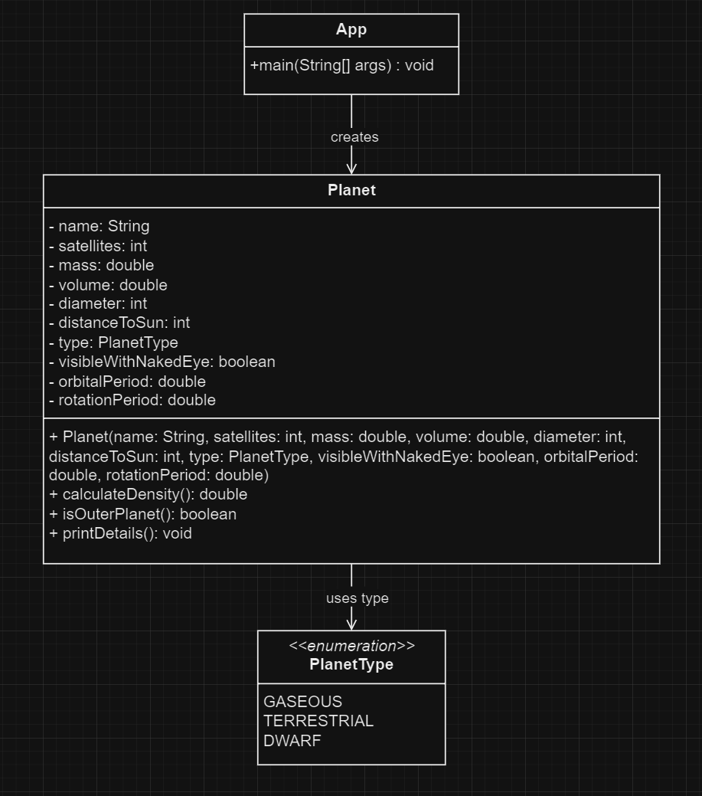
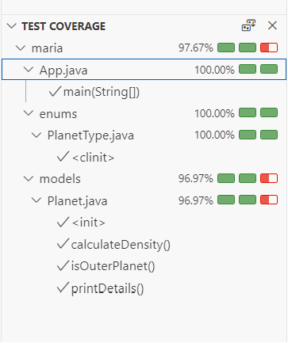

## Solar System

This repository is part of coursework for the Full Stack Web Development course from [Factoria F5](https://factoriaf5.org).

## Requirements:

A program is required to model the concept of a planet in the solar system.

**A planet has the following attributes:**

- A name of type String with an initial value of null.
- Number of satellites of type int with an initial value of zero.
- Mass in kilograms of type double with an initial value of zero.
- Volume in cubic kilometers of type double with an initial value of zero.
- Diameter in kilometers of type int with an initial value of zero.
- Average distance to the Sun in millions of kilometers, of type int with an initial value of zero.
- Type of planet according to its size, of enumerated type with the following possible values: GASEOUS, TERRESTRIAL, and DWARF.
- Observable with the naked eye, of type boolean with an initial value of false.

**The class must include the following methods:**

- The class should have a constructor that initializes the values of its respective attributes.
- Define a method that returns the values of a planet's attributes.
- Calculate the planet's density, as the quotient between its mass and its volume.
- Determine if a planet in the solar system is considered an outer planet.
- An outer planet is located beyond the asteroid belt. The asteroid belt is between 2.1 and 3.4 AU. An Astronomical Unit (AU) is the distance between Earth and the Sun = 149,597,870 km.
- In the main method of the App class, two planets should be created and the values of their attributes displayed on the screen. Additionally, the density of each planet should be printed and whether the planet is an outer planet of the solar system.

**Extras**
- Add two attributes to the Planet class. The first should represent the orbital period of the planet (in years). The second attribute represents the rotation period (in days).
- Modify the constructor of the class to initialize the values of these two new attributes.
- Modify the print method to display the values of the new attributes on the screen.

## UML Diagram

## Test coverage

